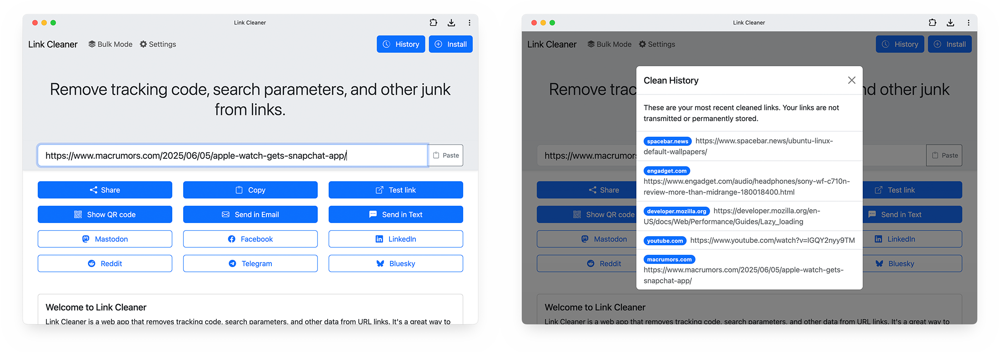

# Link Cleaner

[Link Cleaner](https://linkcleaner.app) is a web app that removes tracking code, search parameters, and other data from URL links. The cleaned links can be copied to the clipboard, viewed as a QR code, send to installed applications using the Web Share API, or shared directly to social media platforms. Link Cleaner can also receive links through the your device's share menu as an installed web application.

Link Cleaner uses [Plausible Analytics](https://plausible.io) to report anonymous usage data, including how many times the app is open, how long it is used, the current country, and how many times links are cleaned. Links are **not** sent anywhere during or after cleaning. See the [Privacy Policy](PRIVACY.md) for more information.

Link Cleaner uses code from [Bootstrap](https://getbootstrap.com/) and [EasyQRCodeJS](https://github.com/ushelp/EasyQRCodeJS). The logo is ["Link 45deg" from Boostrap Icons](https://icons.getbootstrap.com/icons/link-45deg/).